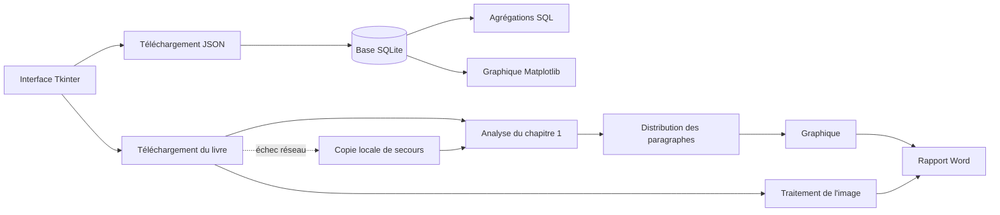

<div align="center">


# Projet Python Avancé — Data & Livre

**Application de bureau en Python pour télécharger, stocker, analyser et représenter des données, puis générer automatiquement un rapport Word.**


</div>

---

Cette application répond au cahier des charges du **projet Python Avancé**.  
Elle combine une interface graphique Tkinter, une API JSON, une base SQLite, des graphiques Matplotlib, l’analyse d’un livre de Project Gutenberg, le traitement d’images et la création d’un document Word.

## Fonctionnalités principales

- Interface de bureau entièrement en français.
- Téléchargement de données JSON depuis Internet.
- Adaptation en français des intitulés affichés.
- Enregistrement et consultation des données dans SQLite.
- Agrégations calculées directement avec des requêtes SQL.
- Graphiques intégrés dans la fenêtre principale.
- Analyse du premier chapitre d’un livre.
- Traitement d’images avec Pillow.
- Export automatique d’un rapport Word.
- Gestion des erreurs réseau et mode de secours local.
- Exécution des téléchargements dans des threads.
- Thème clair ou sombre et taille de police personnalisable.
- Sept tests unitaires.

> [!IMPORTANT]
> Project Gutenberg peut parfois être lent ou inaccessible.  
> L’application essaie plusieurs adresses officielles puis utilise automatiquement une copie locale du livre et de sa couverture. La démonstration peut donc continuer même sans connexion au site.

## Sommaire

- [Démarrage rapide](#démarrage-rapide)
- [Fonctionnement](#fonctionnement)
- [Données JSON et SQLite](#données-json-et-sqlite)
- [Analyse du livre](#analyse-du-livre)
- [Rapport Word](#rapport-word)
- [Installation](#installation)
- [Utilisation](#utilisation)
- [Tests unitaires](#tests-unitaires)
- [Architecture du projet](#architecture-du-projet)
- [Fichiers générés](#fichiers-générés)
- [Technologies](#technologies)
- [Publication sur GitHub](#publication-sur-github)
- [Auteur](#auteur)

## Démarrage rapide

### Sous Windows

Décompressez le projet puis double-cliquez sur :

```text
run.bat
```

Le script installe les dépendances nécessaires et lance l’application.

### Depuis un terminal

```bash
python -m pip install -r requirements.txt
python app.py
```

## Fonctionnement



## Données JSON et SQLite

Les données sont téléchargées depuis l’API JSONPlaceholder puis enregistrées dans une base SQLite locale.

L’application conserve notamment :

| Champ | Description |
|---|---|
| `id` | Identifiant de la tâche |
| `user_id` | Identifiant de l’utilisateur |
| `name` | Intitulé adapté en français |
| `status` | Terminé ou en attente |
| `length` | Longueur de l’intitulé |
| `downloaded_at` | Date et heure du téléchargement |

### Gestion d’une base déjà remplie

Lors d’un nouveau téléchargement, l’utilisateur peut :

1. remplacer les anciennes données ;
2. ajouter uniquement les éléments absents ;
3. annuler l’opération.

### Agrégations SQL

Le bouton **Agrégation SQL** affiche :

- le nombre total de tâches ;
- le nombre de tâches terminées ;
- le nombre de tâches en attente ;
- la longueur moyenne ;
- la longueur minimale ;
- la longueur maximale.

## Analyse du livre

Le livre utilisé est **Alice’s Adventures in Wonderland** de **Lewis Carroll**.

L’application :

1. télécharge le texte du livre ;
2. extrait son titre et son auteur ;
3. récupère le premier chapitre ;
4. sépare le chapitre en paragraphes ;
5. compte les mots de chaque paragraphe ;
6. regroupe les longueurs par dizaines ;
7. calcule les statistiques ;
8. génère un graphique de distribution.

Les statistiques comprennent :

- le nombre de paragraphes ;
- le nombre total de mots ;
- la longueur minimale ;
- la longueur maximale ;
- la moyenne des mots par paragraphe.

## Rapport Word

L’application génère un fichier `.docx` comprenant :

- une page de titre ;
- le titre du livre ;
- le nom de l’auteur ;
- le nom de l’auteur du rapport ;
- une couverture téléchargée puis modifiée ;
- un logo noir et blanc pivoté ;
- le graphique de distribution ;
- les statistiques du premier chapitre ;
- la source des données.

## Installation

### Prérequis

- Python 3.10 ou supérieur ;
- une connexion Internet pour les téléchargements initiaux ;
- Microsoft Word ou LibreOffice pour ouvrir le rapport.

### Cloner le dépôt

```bash
git clone https://github.com/VOTRE-UTILISATEUR/projet-python-avance.git
cd projet-python-avance
```

### Créer un environnement virtuel

#### Windows

```bash
python -m venv .venv
.venv\Scripts\activate
```

#### Linux ou macOS

```bash
python3 -m venv .venv
source .venv/bin/activate
```

### Installer les dépendances

```bash
python -m pip install --upgrade pip
python -m pip install -r requirements.txt
```

## Utilisation

### 1. Charger les données JSON

Dans l’onglet **Données JSON / SQLite** :

1. cliquez sur **Vider la base** pour repartir de zéro ;
2. cliquez sur **Télécharger JSON** ;
3. vérifiez que les données apparaissent dans le tableau ;
4. cliquez sur **Agrégation SQL**.

### 2. Afficher le graphique JSON

Dans l’onglet **Graphique JSON**, cliquez sur :

```text
Afficher le graphique
```

### 3. Analyser le livre

Dans l’onglet **Livre et rapport Word**, cliquez sur :

```text
Télécharger et analyser le livre
```

### 4. Exporter le rapport

Après l’analyse, cliquez sur :

```text
Exporter le rapport Word
```

## Tests unitaires

Lancer tous les tests :

```bash
python -m unittest discover -s tests -v
```

Résultat attendu :

```text
Ran 7 tests
OK
```

Les tests vérifient notamment :

- la stabilité des intitulés français ;
- l’extraction des métadonnées du livre ;
- l’extraction du premier chapitre ;
- le calcul des mots et de la distribution ;
- la présence du livre local de secours ;
- l’insertion et le remplacement des données SQLite ;
- la gestion des doublons ;
- les agrégations SQL.

## Architecture du projet

```text
projet_python_avance/
├── app.py                         # Interface graphique Tkinter
├── api_service.py                 # Téléchargement et adaptation du JSON
├── book_service.py                # Téléchargement et analyse du livre
├── config.py                      # Configuration et chemins
├── database.py                    # Accès à la base SQLite
├── models.py                      # Modèles de données
├── report_service.py              # Création du rapport Word
├── requirements.txt               # Dépendances Python
├── run.bat                        # Lanceur Windows
├── README.md
├── PRESENTATION_ORALE.md
├── .gitignore
│
├── assets/
│   ├── logo_bw.png
│   ├── alice_backup.txt
│   └── alice_cover_backup.jpg
│
├── data/
│   └── .gitkeep
│
├── output/
│   └── .gitkeep
│
└── tests/
    ├── test_api_service.py
    ├── test_book_service.py
    └── test_database.py
```

## Fichiers générés

Les résultats sont enregistrés dans :

```text
output/
```

Exemples :

```text
paragraph_distribution.png
alice_processed.jpg
rapport_alice.docx
```

La base SQLite est créée automatiquement dans :

```text
data/application.db
```

## Technologies

| Technologie | Utilisation |
|---|---|
| Python | Langage principal |
| Tkinter | Interface graphique |
| SQLite | Stockage local |
| Requests | Téléchargements HTTP |
| Matplotlib | Graphiques |
| Pillow | Traitement d’images |
| python-docx | Génération du rapport Word |
| unittest | Tests automatisés |
| Threading | Téléchargements sans blocage de l’interface |

## Publication sur GitHub

Créez d’abord un dépôt vide, puis exécutez :

```bash
git init
git add .
git commit -m "Ajout du projet Python Avancé"
git branch -M main
git remote add origin https://github.com/VOTRE-UTILISATEUR/projet-python-avance.git
git push -u origin main
```

> Remplacez `VOTRE-UTILISATEUR` par votre nom d’utilisateur GitHub.

## Auteur

**Mariyanayagam Mickaël**  
Étudiant à Ynov Campus Paris

---

<div align="center">

Développé dans le cadre du projet **Python Avancé**.

</div>
